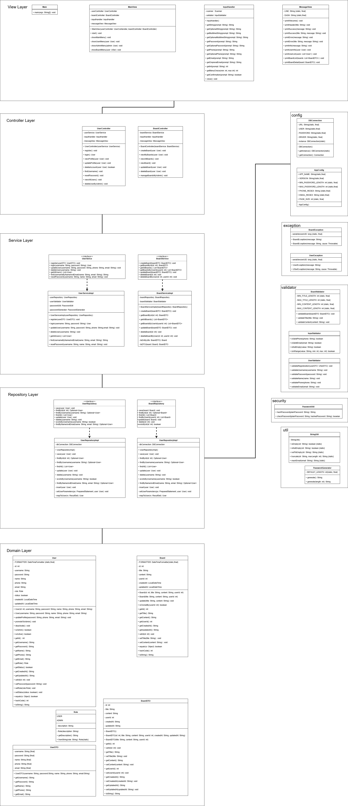
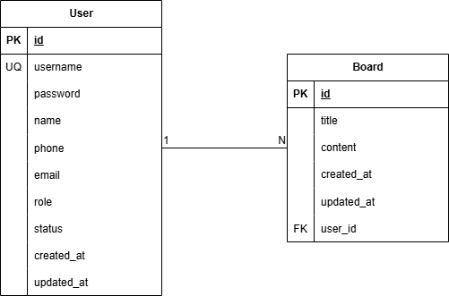

# 🧑‍💻 회원 관리 및 게시판 시스템 (Java Mini Project)

## 📌 프로젝트 개요
Java 기반의 콘솔 애플리케이션으로 **회원 관리**와 **게시판 기능**을 구현한 미니 프로젝트입니다.  
**객체지향 프로그래밍(OOP)** 원칙을 적용하고, **MVC 패턴 구조**, **예외 처리**, **컬렉션 활용** 등을 통해  
기초적인 백엔드 로직과 데이터 흐름을 이해하는 데 초점을 맞추었습니다.

---

## 🎯 개발 목표
- MVC(Model-View-Controller) 패턴 구조 학습  
- Entity / DTO / Repository / Service / Controller 계층 구성  
- 회원가입 / 로그인 기능 구현  
- 게시판 글 작성, 조회, 수정, 삭제 기능 구현  
- 예외 처리(`try-catch`, 사용자 정의 예외 클래스)  
- `List`, `Map` 등 컬렉션 활용  
- 데이터 유효성 검사 및 비밀번호 암호화

---

📅 **개발 기간:** 2025.10.31 ~ 2025.11.03(2일)

🧩 **프로젝트 유형:** 개인 프로젝트  

---

## 👨‍🎓 개발자 정보
**개발자:** 한해찬  
**GitHub:** [@haechan419](https://github.com/haechan419)  

---

## 🧱 기술 스택
| 구분 | 사용 기술 |
|------|------------|
| Language | Java (JDK 21) |
| IDE | Eclipse |
| Architecture | MVC Pattern |
| Library | java.util, java.io ... |
| DB | MySQL |
| Version Control | Git / GitHub |

---

## 📂 프로젝트 구조
```plaintext
memberBoard/
├── Main.java                     # 애플리케이션 시작점
│
├── config/                       # 설정 관련
│   ├── DBConnection.java         # DB 연결 (싱글톤)
│   └── AppConfig.java            # 애플리케이션 설정 상수
│
├── domain/                       # 도메인 모델
│   ├── entity/                   # 엔티티 (DB 테이블과 매핑)
│   │   ├── User.java             # 사용자 엔티티
│   │   ├── Board.java            # 게시글 엔티티
│   │   └── Role.java             # 권한 Enum
│   └── dto/                      # 데이터 전송 객체
│       ├── UserDTO.java          # 사용자 DTO
│       └── BoardDTO.java         # 게시글 DTO
│
├── repository/                   # 데이터 접근 계층
│   ├── UserRepository.java       # 사용자 Repository 인터페이스
│   ├── UserRepositoryImpl.java   # 사용자 Repository 구현
│   ├── BoardRepository.java      # 게시글 Repository 인터페이스
│   └── BoardRepositoryImpl.java  # 게시글 Repository 구현
│
├── service/                      # 비즈니스 로직 계층
│   ├── UserService.java          # 사용자 Service 인터페이스
│   ├── UserServiceImpl.java      # 사용자 Service 구현
│   ├── BoardService.java         # 게시글 Service 인터페이스
│   └── BoardServiceImpl.java     # 게시글 Service 구현
│
├── controller/                   # 컨트롤러 계층
│   ├── UserController.java       # 사용자 컨트롤러
│   └── BoardController.java      # 게시글 컨트롤러
│
├── view/                         # 뷰 계층 (UI)
│   ├── MainView.java             # 메인 화면 (메뉴)
│   ├── InputHandler.java         # 입력 처리
│   └── MessageView.java          # 출력 처리
│
├── exception/                    # 예외 처리
│   ├── UserException.java        # 사용자 관련 예외
│   └── BoardException.java       # 게시글 관련 예외
│
├── validator/                    # 유효성 검증
│   ├── UserValidator.java        # 사용자 입력 검증
│   ├── BoardValidator.java       # 게시글 입력 검증
│   └── InputValidator.java       # 공통 입력 검증
│
├── security/                     # 보안 관련
│   └── PasswordUtil.java         # 비밀번호 암호화
│
└── util/                         # 유틸리티
    ├── PasswordGenerator.java    # 임시 비밀번호 생성
    └── StringUtil.java           # 문자열 유틸
```
---

## 👥 주요 기능

### 🔐 회원 기능
| 기능 | 설명 |
|------|------|
| 회원가입 | 아이디 중복 검사, 비밀번호 암호화 저장 |
| 로그인 | 아이디/비밀번호 검증 후 세션 처리 |
| 로그아웃 | 로그인 상태 해제 |
| 회원 목록 보기 | 관리자 전용 기능 (옵션) |

### 📝 게시판 기능
| 기능 | 설명 |
|------|------|
| 글 작성 | 로그인한 사용자만 작성 가능 |
| 글 목록 보기 | 전체 게시글 출력 (작성자, 날짜 포함) |
| 글 상세보기 | 선택한 게시글의 상세 내용 표시 |
| 글 수정 | 작성자 본인만 수정 가능 |
| 글 삭제 | 작성자 본인만 삭제 가능 |

---

## ⚙️ 실행 예시

=========================
회원 관리 및 게시판

회원가입

로그인

종료

선택: 1
[회원가입]
아이디: test01
비밀번호: ****
닉네임: 홍길동
✅ 회원가입이 완료되었습니다!

선택: 2
[로그인]
아이디: test01
비밀번호: ****
✅ 로그인 성공!

게시판 메뉴로 이동합니다.

---

클래스 다이어그램


---

ER 다이어그램

---

논리형 다이어그램


---

## 🧩 예외 처리 설계
- `InvalidInputException`: 입력값 공백/형식 오류
- `DuplicateIdException`: 회원가입 ID 중복
- `LoginFailedException`: 로그인 실패
- `DataNotFoundException`: 조회 데이터 없음
- `AuthorizationException`: 권한 없음
- `DatabaseException` - DB연결/쿼리 오류 

---

## 🧠 학습 포인트
- 객체 간 의존 관계 주입 및 단일 책임 원칙 적용
- `try-catch` 및 사용자 정의 예외 클래스 구현
- `List`, `Map` 등 컬렉션 활용을 통한 데이터 저장/조회  
- MVC 패턴 구조를 통한 역할 분리 이해  
- 파일 입출력(IO) 또는 DB 연동으로 데이터 영속성 확보  
- 비밀번호 암호화(`BCrypt`) 적용  
- 관리자(Admin) 계정 추가 및 사용자 관리 기능  

---

## 🏁 향후 개선 방향
- GUI 또는 웹 기반으로 확장 (Spring Boot로 리팩토링 가능)  


