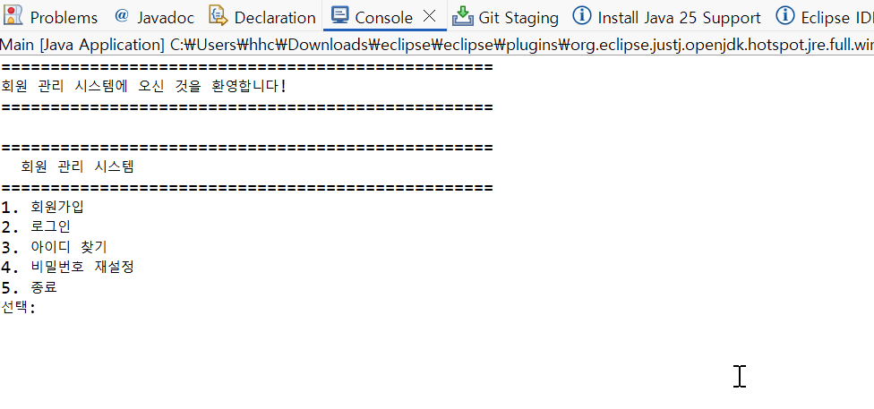
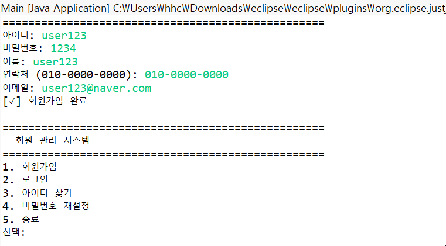
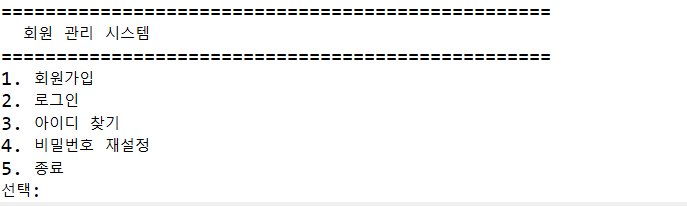
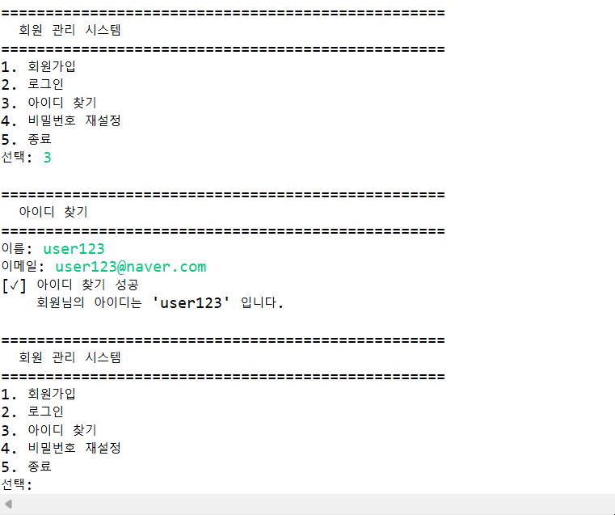
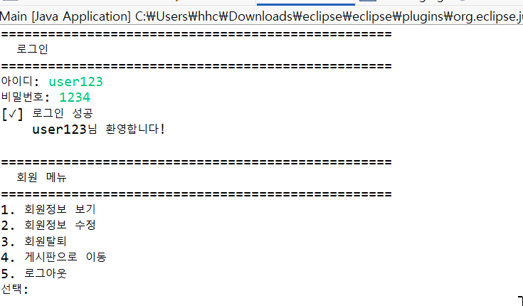
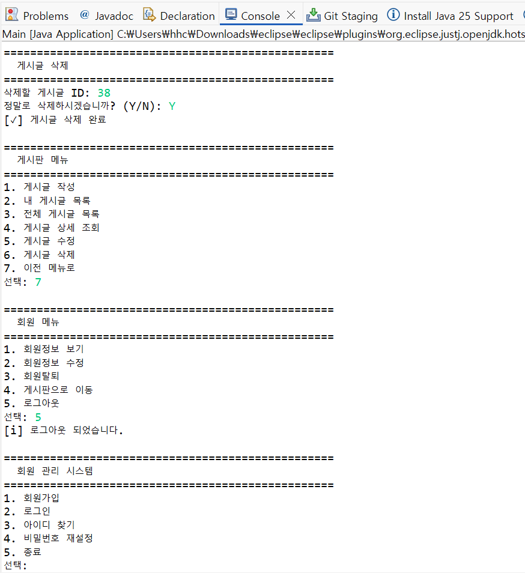
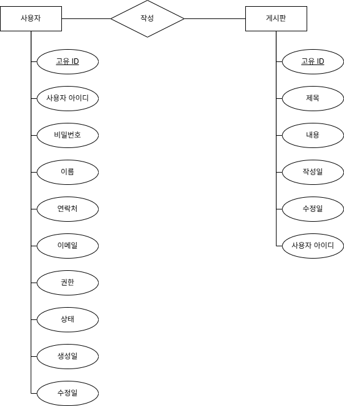

# 🧑‍💻 회원 관리 및 게시판 시스템 (Java Mini Project)

> 💬 **Java 콘솔 기반의 회원 관리 및 게시판 기능 구현 프로젝트**  
> MVC 패턴, 예외 처리, 컬렉션, DB 연동을 중심으로 한 **객체지향 설계 학습용 프로젝트**

---

## 📌 프로젝트 개요

Java 기반의 콘솔 애플리케이션으로 **회원 관리**와 **게시판 기능**을 구현한 미니 프로젝트입니다.  
**객체지향 프로그래밍(OOP)** 원칙을 적용하고, **MVC 구조**, **예외 처리**, **컬렉션 활용**을 통해  
기초적인 백엔드 로직과 데이터 흐름을 이해하는 데 초점을 맞추었습니다.

---

## 🎯 개발 목표

- MVC(Model-View-Controller) 패턴 구조 학습  
- Entity / DTO / Repository / Service / Controller 계층 구성  
- 회원가입 / 로그인 기능 구현  
- 게시판 글 작성, 조회, 수정, 삭제 기능 구현  
- 예외 처리(`try-catch`, 사용자 정의 예외 클래스)  
- `List`, `Map` 등 컬렉션 활용  
- 데이터 유효성 검사 및 비밀번호 암호화  

---

📅 **개발 기간:** `2025.10.31 ~ 2025.11.03 (2일)`  
🧩 **프로젝트 유형:** 개인 프로젝트  

---

## 👨‍🎓 개발자 정보

| 구분 | 내용 |
|------|------|
| 👤 개발자 | **한해찬** |
| 💻 GitHub | [@haechan419](https://github.com/haechan419) |

---

## 🧱 기술 스택

| 구분 | 사용 기술 |
|------|------------|
| Language | Java (JDK 21) |
| IDE | Eclipse (2025-09) |
| Architecture | MVC Pattern |
| Library | java.util, java.io ... |
| DB | MySQL |
| Version Control | Git / GitHub |

---

## 📂 프로젝트 구조

```plaintext
memberBoard/
├── Main.java                     # 애플리케이션 시작점
│
├── config/                       # 설정 관련
│   ├── DBConnection.java         # DB 연결 (싱글톤)
│   └── AppConfig.java            # 애플리케이션 설정 상수
│
├── domain/                       # 도메인 모델
│   ├── entity/                   # 엔티티 (DB 테이블과 매핑)
│   │   ├── User.java
│   │   ├── Board.java
│   │   └── Role.java
│   └── dto/
│       ├── UserDTO.java
│       └── BoardDTO.java
│
├── repository/
│   ├── UserRepository.java
│   ├── UserRepositoryImpl.java
│   ├── BoardRepository.java
│   └── BoardRepositoryImpl.java
│
├── service/
│   ├── UserService.java
│   ├── UserServiceImpl.java
│   ├── BoardService.java
│   └── BoardServiceImpl.java
│
├── controller/
│   ├── UserController.java
│   └── BoardController.java
│
├── view/
│   ├── MainView.java
│   ├── InputHandler.java
│   └── MessageView.java
│
├── exception/
│   ├── UserException.java
│   └── BoardException.java
│
├── validator/
│   ├── UserValidator.java
│   ├── BoardValidator.java
│   └── InputValidator.java
│
├── security/
│   └── PasswordUtil.java
│
└── util/
    ├── PasswordGenerator.java
    └── StringUtil.java
```
---

## 🚀 주요 기능 (Features)

### 🔐 회원 기능 (User Management)
| 기능 | 설명 |
|------|------|
| 🧾 **회원가입** | 아이디 중복 검사 및 비밀번호 암호화 저장 |
| 🔑 **로그인** | 아이디 / 비밀번호 검증 후 세션 처리 |
| 🚪 **로그아웃** | 로그인 상태 해제 |
| 👥 **회원 목록 보기** | 관리자 전용 기능 (선택적 구현) |

---

### 📝 게시판 기능 (Board Management)
| 기능 | 설명 |
|------|------|
| ✏️ **글 작성** | 로그인한 사용자만 게시글 작성 가능 |
| 📋 **글 목록 보기** | 전체 게시글 조회 (작성자, 작성일 포함) |
| 🔍 **글 상세보기** | 선택한 게시글의 상세 내용 표시 |
| 🧰 **글 수정** | 작성자 본인만 수정 가능 |
| 🗑️ **글 삭제** | 작성자 본인만 삭제 가능 |

---

## ⚙️ 실행 예시 (Demo)

> 💡 실제 동작 예시 화면 (GIF 애니메이션)

| 기능 | 미리보기 |
|------|-----------|
| **회원가입** |  |
| **로그인** |  |
| **아이디 찾기** |  |
| **비밀번호 재설정** |  |
| **사용자 정보 수정** |  |
| **게시판 CRUD** |  |
| **관리자 메뉴** |  |

---

## 🧩 시스템 구조 다이어그램 (System Diagrams)

### 📘 클래스 다이어그램


---

### 🗃️ ER 다이어그램 (Entity–Relationship Diagram)


---

### 🧮 논리형 다이어그램 (Logical Data Model)


---

## ⚠️ 예외 처리 설계 (Exception Handling)

| 예외 클래스 | 설명 |
|--------------|------|
| `InvalidInputException` | 입력값 공백 / 형식 오류 발생 시 |
| `DuplicateIdException` | 회원가입 시 아이디 중복 발생 |
| `LoginFailedException` | 로그인 실패 (존재하지 않는 계정 또는 비밀번호 불일치) |
| `DataNotFoundException` | 데이터 조회 실패 시 |
| `AuthorizationException` | 권한 없는 접근 시 |
| `DatabaseException` | DB 연결 또는 쿼리 오류 발생 시 |

---

## 🧠 학습 포인트 (Learning Points)

✅ **객체 간 의존 관계 주입(DI)** 및 **단일 책임 원칙(SRP)** 적용  
✅ `try-catch` 및 **사용자 정의 예외 클래스** 구현  
✅ `List`, `Map` 등의 **컬렉션 활용을 통한 데이터 관리**  
✅ **MVC 패턴 구조**를 통한 명확한 역할 분리  
✅ **파일 입출력(IO)** 또는 **MySQL 연동**으로 데이터 영속성 확보  
✅ **비밀번호 암호화(BCrypt)** 적용  
✅ **관리자(Admin)** 계정 추가 및 사용자 관리 기능 구현  

---

## 🏁 향후 개선 방향 (Future Improvements)

- 🖥️ **GUI / 웹 기반 확장 (JavaFX or Spring Boot 리팩토링)**  
- 🌐 **REST API** 및 **JWT 인증 시스템** 구현  
- 🧪 **JUnit 테스트 코드** 추가  
- 🔗 **React / Vue 프론트엔드 연동**  
- 🗄️ **JPA / MyBatis** 기반 ORM 데이터 관리  

---

## 🎯 프로젝트 회고 (Project Retrospective)

> 💬 **“코드보다 구조를 먼저 생각하라.”**

이번 프로젝트는 **Java 콘솔 기반 회원 관리 및 게시판 시스템**으로,  
**객체지향 설계(OOP)** 와 **MVC 아키텍처**를 실제 코드로 구현하며  
백엔드의 기본 구조를 이해하는 데 초점을 맞추었습니다.

핵심 기능은 다음과 같습니다:

- 회원가입 / 로그인 / 로그아웃  
- 게시글 CRUD (Create, Read, Update, Delete)  
- 예외 처리 및 데이터 유효성 검증  
- 비밀번호 암호화 및 관리자 기능  

---

### 🧱 구조적 설계

- **DTO / Entity / Repository / Service / Controller** 구조를 설계하여  
  계층 간 **책임 분리** 및 **유지보수성**을 확보하였습니다.  
- **BCrypt 암호화**, **MySQL 연동**, **예외 처리 시스템화**를 통해  
  실제 서비스 환경에 가까운 로직을 구현했습니다.

---

### 🧩 얻은 인사이트

- 단순한 콘솔 프로젝트라도 **설계 단계의 중요성**을 체감  
- **예외 처리와 입력 검증의 필요성** 이해  
- **OOP와 MVC 아키텍처의 실질적 적용 방법** 학습  
- 코드보다 **유지보수와 확장성**을 고려한 사고의 전환  

---

## 🌱 다음 단계 (Next Step)

> 🧭 **Spring Boot + JPA + React** 기반의 풀스택 프로젝트로 확장 예정

- Spring Boot로 서버 리팩토링  
- RESTful API 설계 및 JWT 인증 추가  
- React 프론트엔드와 연동하여 웹 서비스화  
- 코드 리팩토링 및 테스트 자동화 진행  

---

> ✨ **“기초를 탄탄히 다진 백엔드 개발자”로 성장하기 위한 첫 걸음이 되었습니다.**  
> 앞으로는 이 경험을 기반으로 **실무형 웹 서비스 개발**로 확장할 예정입니다.

---
